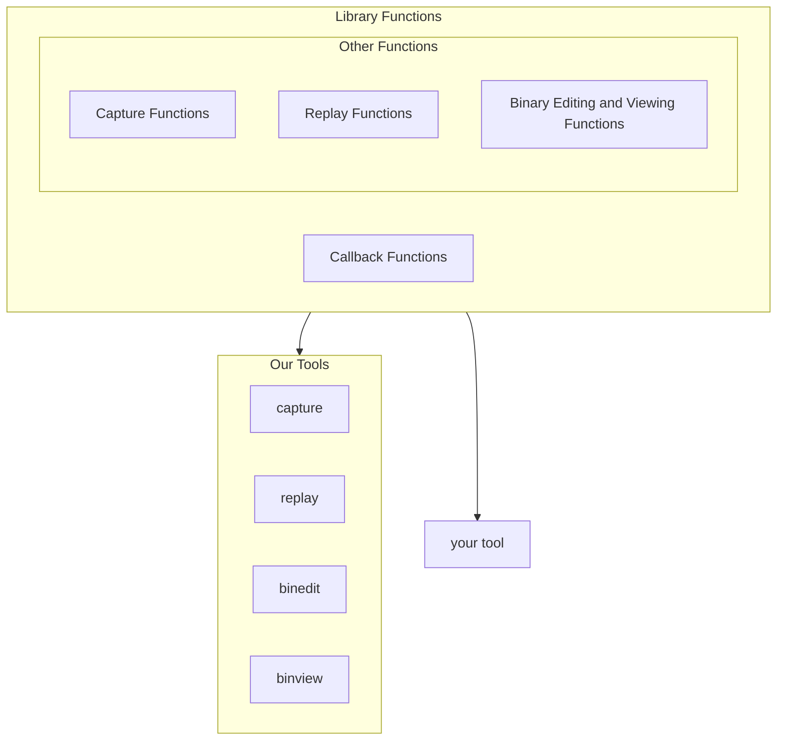

hipBIT is a set of tools and library functions for capturing compute activity of AMD GPUs that use HIP.
We provide simple implementations of common GPU profiling and instrumentation tasks, and a set of library functions for creating **your own** profiling and GPU binary editing tools.
We require **no** access to the source code or debugging symbols.

# Why would I want this?
* You might want to examine the assembly code for your HIP application. 
* You might like to see how your environment affected HIP activity and GPU binaries. (For some users, the GPU code they compile and launch depends on their  runtime enviroment)
* You want to capture GPU activity for later analysis (without access to the original executable)
* You want to replay GPU activity from a textual description of the HIP calls and kernel launches
* You want to modify or add instrumentation to GPU binaries

We provide the following CLI tools:
* Capture HIP functions and kernel launches - `capture`
* Replay captured HIP activity, allocations, copies, and kernel launches - `replay`
* View and edit captured activity - `capview` 
* View and edit GPU binary (assembly) code for captured activity - `binview`/`binedit`

# Usage & Project Architecture 


Besides these CLI tools, we also provide a set of functions that can be used to create your own profiling and binary editing tools.
To create your own tools, implement any of the core [callback functions](###Callback functions) and compile the resulting object with the `libhipcapture.a` library we provide. 
You'll be left with an .so file `yourtool.so` that can be ran with any HIP executable using `LD_PRELOAD`
```bash
$ gcc mycallbacks.c -lhipcatpure.a -shared -o mytool.so
```

You can now run your tool with any HIP executable with the following:
```bash
$ ./vectoradd_hip.exe
   < normal output>

$ LD_PRELOAD=mytool.so ./vectoradd_hip.exe
   < modified output>
```
You can also compile your callbacks separtely and provide them to our CLI `attach` tool with a PID to attch your tool to an existing process.

Besides the callback functions, we provide functions that can be used to implement a large variety of tracing, capture, and instrumentation tools for GPU compute programs.
These functions include simple wrappers over the HIP activity API as well as more complex capture and editing functions.

## Library Function Listing
Below is a listing of all core functionality.

### Callback Functions
When implemented and running with a PRELOADED `libhipcapture.a`, these functions will be executed as any HIP program executes. 
No source code or debugging symbols are required for the underlying HIP program.

```C
// If call_system is true, executes the system library implementation
// after executing your callback
void onHIPCall(const char* HIP_function_name, YourFunc* func, bool call_system);
void onHIPLaunch(YourFunc* func, bool call_system);
```

### Capture, Inspection, & Editing Functions
These are various functions for implementing capture, replay, and binary editing tools.
By placing calls to these functions in the callbacks above, you can create your own tools for GPU binaries.

### Capture Functions
```C
// arg_data points to a buffer to be filled with argument data, or NULL and 
// an allocated buffer of the data will be returned
bool captureHIPFunc(const char* HIP_function_name, char* arg_data, size_t arg_size) 
```

### Replay Functions

### Instrumentation & Editing Functions

# Tool Description & CLI Reference
